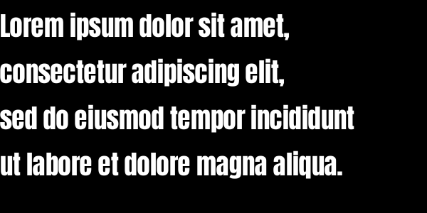

[](https://github.com/shampoofactory/bmfont_rs/actions)

BMFont font descriptor parsing library.

Manipulate, import and export [BMFont](http://www.angelcode.com/products/bmfont/) descriptor
files in text, binary, XML formats and more.

## Documentation

https://docs.rs/bmfont_rs/0.4.0/bmfont_rs/

## Install

Simply configure your `Cargo.toml`:

```toml
[dependencies]
bmfont_rs = "0.4.0"
```

## Overview

This crate provides building, manipulation, import and export functions for BMFont descriptor files.

The core data object is the [Font](https://docs.rs/bmfont_rs/latest/bmfont_rs/struct.Font.html).
This struct holds, in its entirety, the data contained within a BMFont descriptor file.
When paired with the associated texture bitmap file/s, we have the information required to render the font in question.

Due to the numerous graphics backends and usage requirements, this crate does not attempt to offer a universal rendering solution.

This crate contains no unsafe code.
Also, unless specified by compilation switches, it doesn't pull in any external dependencies.

## Basic usage

The modules are organized around the core BMFont file formats:
- `text` : text format
- `binary` : binary format
- `json` : JSON format, requires: `--features json`
- `xml` : XML format, requires: `--features xml`

Each module is provides a number of import `from_...` and export: `to_...` functions.

To use:
1. Select the desired BMFont format you want to work with.
2. Select the appropriate from/ to methods based on the data structures you want to work with.

Example: import a BMFont text format file.

```rust
use std::io;
use std::io::prelude::*;
use std::fs;

fn main() -> bmfont_rs::Result<()> {
    let mut buf = fs::read("font.fnt")?;
    let font = bmfont_rs::text::from_bytes(&buf)?;
    println!("{:?}", font);
    Ok(())
}
```

Example: export a BMFont text format file.
 ```rust
 use std::io;
 use std::io::prelude::*;
 use std::fs::File;

 fn main() -> bmfont_rs::Result<()> {
     let font = bmfont_rs::Font::default();
     let mut writer = File::create("font.fnt")?;
     bmfont_rs::text::to_writer(&mut writer, &font)?;
     Ok(())
 }
 ```

## Advanced usage - broken files

Unfortunately, there exist several BMFont tools that output broken files.
Either they do not comply with the BMFont standard as written or contain other errors.
When attempting to load these files, `bmfont_rs` will emit an error describing the problem.

We may be able to work around or ignore some of these problems using the [LoadSettings](https://docs.rs/bmfont_rs/latest/bmfont_rs/struct.LoadSettings.html) struct.
Simply build the `LoadSettings` instance using the desired behavior switches and pass it into the `ext` form of the load function.

If you encounter a BMFont file that appears to work with other tools, but not `bmfont_rs` then kindly open a ticket.
It may be possible to add the correct behavior switch in future versions of `bmfont_rs`.

Example: import a BMFont text file with incorrect character counts.
```rust
use std::io;
use std::io::prelude::*;
use std::fs;

fn main() -> bmfont_rs::Result<()> {
    let src = fs::read_to_string("font.txt")?;
    let settings = bmfont_rs::LoadSettings::default().ignore_counts();
    let font = bmfont_rs::text::from_str_ext(&src, &settings)?;
    println!("{:?}", font);
}
```

## Advanced usage - string safety

This library defines unsafe strings as those containing ASCII control characters. Specifically ASCII codes 00 to 31 (inclusive) and 127.

When attempting to load files containing ASCII control characters, an [UnsafeValueString](https://docs.rs/bmfont_rs/latest/bmfont_rs/enum.Error.html) error is thrown. This behavior can be disabled using the [LoadSettings](https://docs.rs/bmfont_rs/latest/bmfont_rs/struct.LoadSettings.html) struct.

Any additional string/ input sanitization MUST be undertaken by users in accordance with their use cases.
Take particular care that Font page file names from untrusted sources do not allow unintended file access, e.g. `../../secret/file.png`.

The BMFont format specifies strings at:
- Font::info::face
- Font::pages 
- Info::charset (Undefined)

## Examples: render



The above text was generated with the [render.rs](examples/render.rs) example.

If you are uncertain how one might use a BMFont descriptor to render output, this example would be worth studying.
Substituting your own graphics backend should not be too difficult.


Due to the numerous graphics backends and usage requirements, this crate makes no attempt at offering a universal rendering solution.

Execute from the project root with:
```bash
cargo run --example render FILE
```

Where FILE is the output image destination (png or jpg) extension:

```bash
cargo run --example render ~/Desktop/lorem.png
```

## Examples: text format

BMFont text format files are ubiquitous, human readable and easily tinkered with.
However, not all tools obey the correct parameter types or constraints, which may result in incompatibility.

Execute from the project root with:
```bash
cargo run --example text
```

## Examples: binary

BMFont binary files are compact, unambiguous and efficient to parse.
However, tooling support may be limited and they are not human readable.

Execute from the project root with:
```bash
cargo run --example binary
```

## Examples: JSON

JSON functionality is feature gated: `--features json`.
When activated, additional dependencies are pulled in assist with JSON processing.

Execute from the project root with:
```bash
cargo run --example json --features json
```

## Examples: XML

XML functionality is feature gated: `--features xml`.
When activated, additional dependencies are pulled in assist with XML processing.

Execute from the project root with:
```bash
cargo run --example xml --features xml
```

## Tests

This crate is equipped with numerous tests.

Execute from the project root with:

```
cargo test --features "json xml"
```

## BMFont

The BMFont homepage is [here](http://www.angelcode.com/products/bmfont/). The site includes
detailed [documentation](http://www.angelcode.com/products/bmfont/documentation.html), BMFont itself
and source code.

I am in no way affiliated with `www.angelcode.com` or BMFont.
All trademarks belong to their respective owners.

## License

Licensed under either of

 * Apache License, Version 2.0
   ([LICENSE-APACHE](LICENSE-APACHE) or http://www.apache.org/licenses/LICENSE-2.0)
 * MIT license
   ([LICENSE-MIT](LICENSE-MIT) or http://opensource.org/licenses/MIT)

at your option.
